# Vue music app

## 项目描述

这是一个基于 `Vue2.x` 和[网易云音乐 API ](https://github.com/Binaryify/NeteaseCloudMusicApi)制作的移动端 `web app` 项目；由于是出于练习和实验的目的，因此并非是网易云音乐 `app` 的**替代品**，目前也没有涵盖全部的功能；

该项目主要使用的一些工具有：

1. `webpack` 和 `webpack-dev-server`
2. `vue` 全家桶
3. [NeteaseCloudMusicApi 项目](https://github.com/Binaryify/NeteaseCloudMusicApi)
4. `axios`
5. `better-scroll`
6. `vue-lazyload`
7. `Iconfont`
8. `Muse-UI`

线上地址：[http://xiexuefeng.cc/app/music](http://xiexuefeng.cc/app/music)


## 使用须知

由于项目使用的 `API` 接口完全是基于 `NeteaseCloudMusicApi` 项目，因此需要事先启动该项目作为接口服务器（无论是本地还是云上）；启动好后修改 `src/index.js` 文件中的 `API` 接口设置为实际使用的接口地址即可。

## 如何运行

### 安装依赖

```sh
npm i
```

### 开发

```sh
npm start
```

默认端口为 `8080`；

### 打包发布

```sh
npm run build
```

默认打包路径为 `dist`；

## 功能说明

由于是针对移动端设计的 `web app`，因此采用了 `rem` 布局来适应移动端不同分辨率的设备；设计稿是基于 `375px` 宽度的设备，仿照网易云音乐 `app` 的页面布局和设计。目前制作的功能界面有：

### 登录页面（伪）

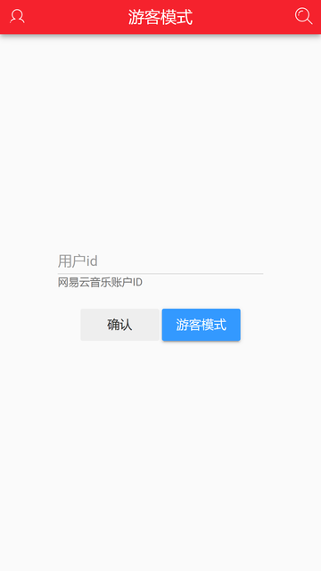

为啥说是『伪』登录，因为这里只是获取用户的 `uid`，此后获取到的数据都是一些**公开只读**的数据，而涉及到真正改变用户信息的操作（如收藏，点赞，评论等等）都不能使用；其实 `NeteaseCloudMusicApi` 项目提供了与网易云音乐 `app` 一样的手机或邮箱登录的接口，但是由于我的目的不是制作替代品，只是练习项目和试验一些功能，利用 `uid` 获取一些『只读』数据已经足够了（况且还涉及到用户密码和安全问题）。

那么如何查询自己的网易云音乐账户 `ID` 号呢？那就需要在网易云音乐 `PC` 网页端查看自己的个人主页，诸如`https://music.163.com/#/user/home?id=xxxxxxx`，`id` 后那串数字就是账户 `ID`。

#### 关于游客模式

游客模式实际上就是没有获取用户`uid`而已，因此有关『登录』用户的信息就无法查看（比如侧边栏信息和首页的用户歌单等），其他的数据基本上没有影响。

### 首页

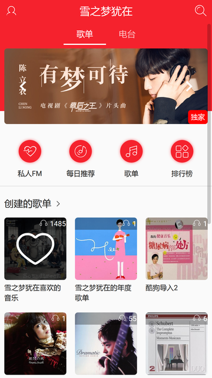

### 侧边栏

首页顶部左边的图标，点击可弹出侧边栏查看用户信息，以及一些设置；

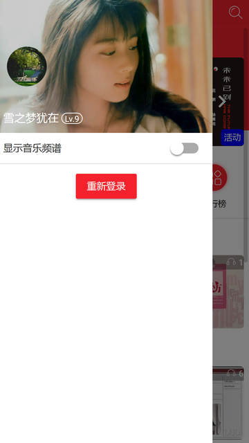

向左滑动或点击外侧可以收回；

### 查看更多歌单项

首页歌单区块默认最多显示两排（`2x3`，`6` 个）歌单信息，点击栏目标题底部弹出全部信息：

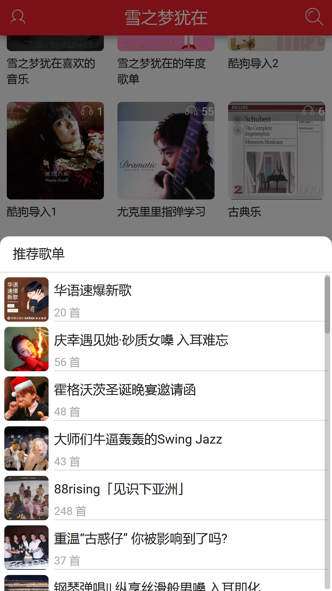

### 歌单详情页

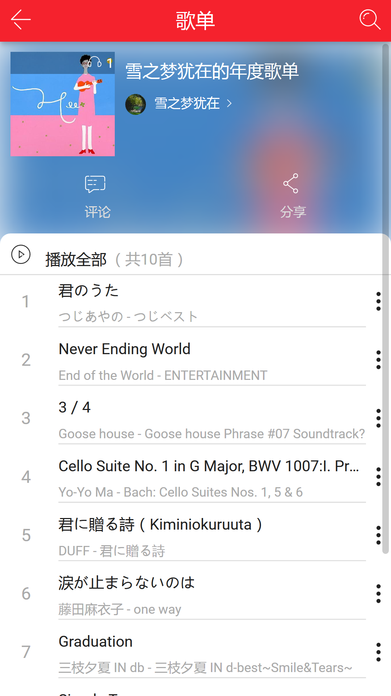

### 歌曲操作弹窗

带有 `3` 个竖排原点的图标，点击会出现一个关于歌曲操作的底部弹窗：

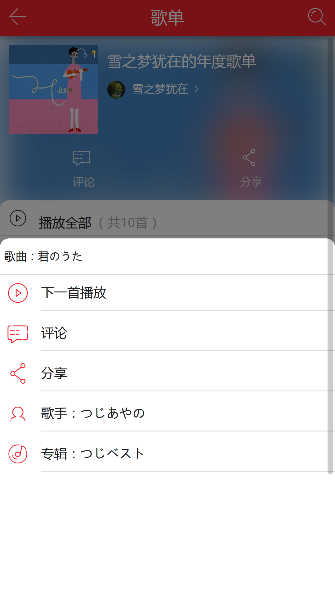

### 底部小播放器

点击歌单或专辑等页面的歌曲项后，底部会出现一个小播放器：

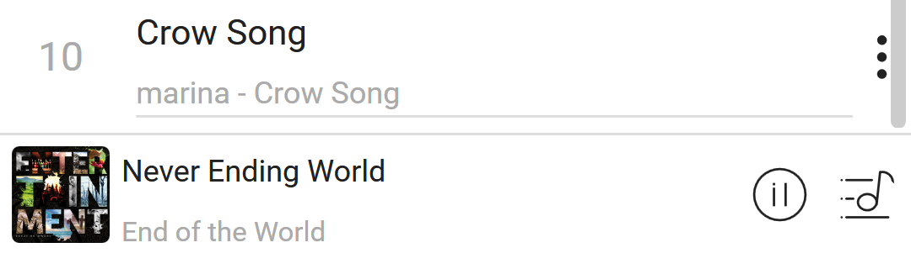

### 全屏播放

点击底部播放器会跳转到全屏播放页：

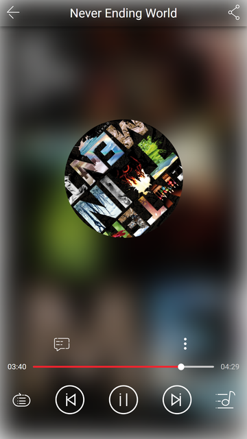

开启『显示频谱』选项后（默认关闭，因为有些浏览器对于 `WebAuio API` 支持不够），可以在封面看到实时的频谱图：


点击封面可以切换到全屏歌词页面：

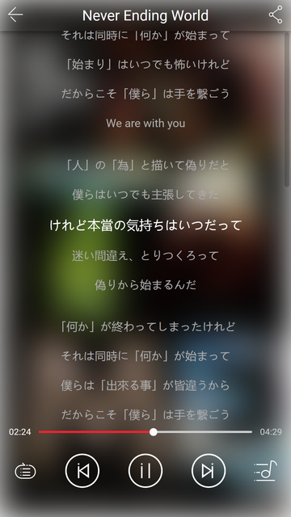

### 当前播放列表

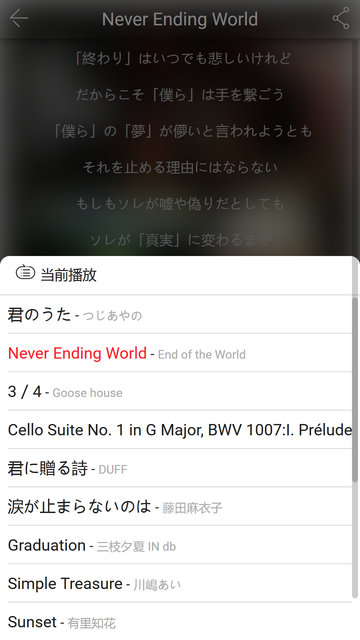

### 评论页面

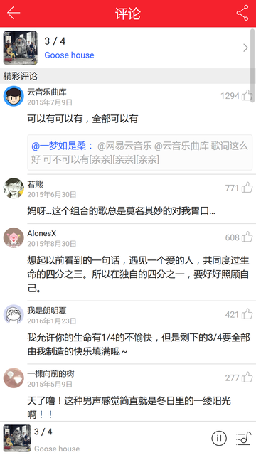

### 专辑页面

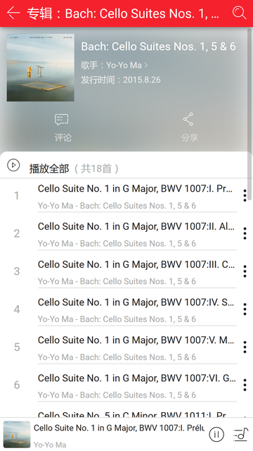

### 歌手详情页面

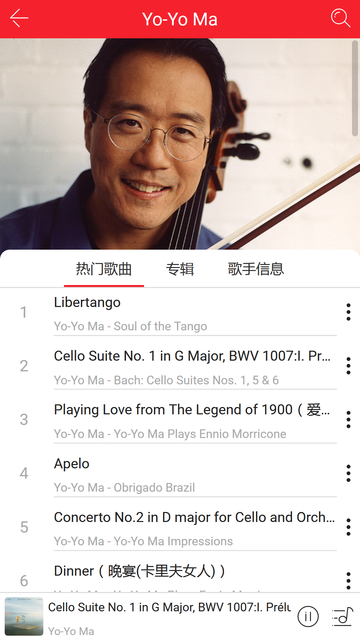

### 用户详情页

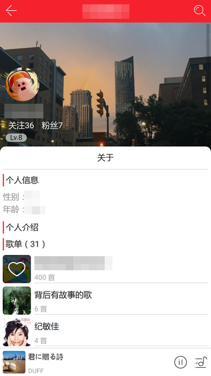

### 搜索页

点击顶部菜单中的搜索图标即可进入搜索页面，在输入框中输入关键字，回车后即可获取搜索结果；目前只支持单曲类型。

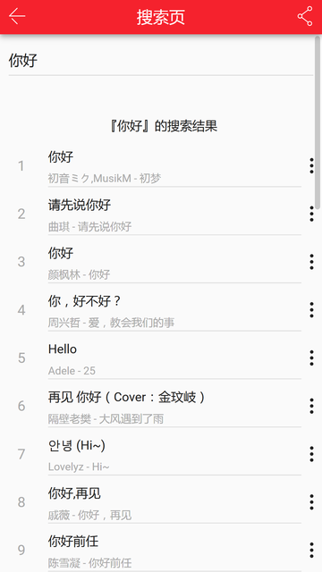

## 个人笔记

在写这个项目的时候当然也遇到许多问题，基本上遇到的问题都会记录下来，其中有些专门进行了整理放在博客上：

1. [关于rem布局 | snowdream](https://note.xiexuefeng.cc/post/rem-layout/)
2. [如何实现歌词同步显示 | snowdream](https://note.xiexuefeng.cc/post/sync-lyric/)
3. [音频播放器的制作与WebAudio API | snowdream](https://note.xiexuefeng.cc/post/music-player-and-webaudio/)
4. [Event对象与自定义事件 | snowdream](https://note.xiexuefeng.cc/post/js-event-and-customed-js-event/)